# ForgeML

**Intelligent ML Experimentation & Deployment Platform**

A full-stack MLOps platform that takes a user from a raw CSV to a trained,
evaluated, explainable, and deployable ML model — with an LLM-assisted
planning and analysis layer on top.

Built as a portfolio project to demonstrate the complete ML lifecycle:
data profiling, validation, preprocessing, model training, experiment
tracking, model explainability, a model registry, a prediction API, and
LLM-assisted workflows — all behind a real full-stack application, not
just notebooks.

---

## Screenshots

### Dashboard
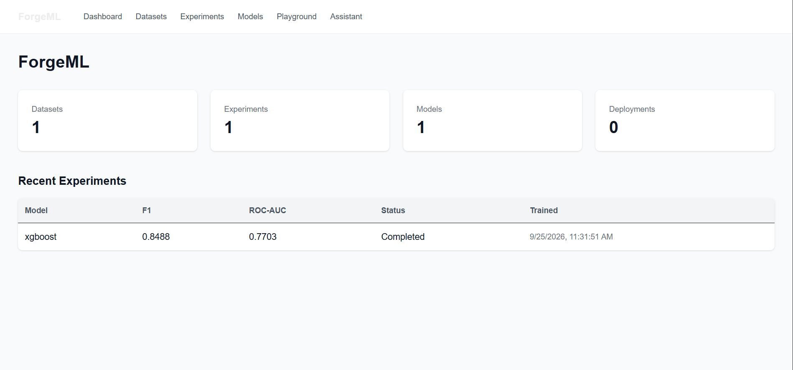

### Dataset upload and profiling
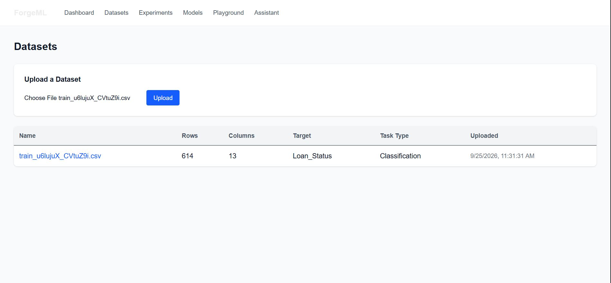
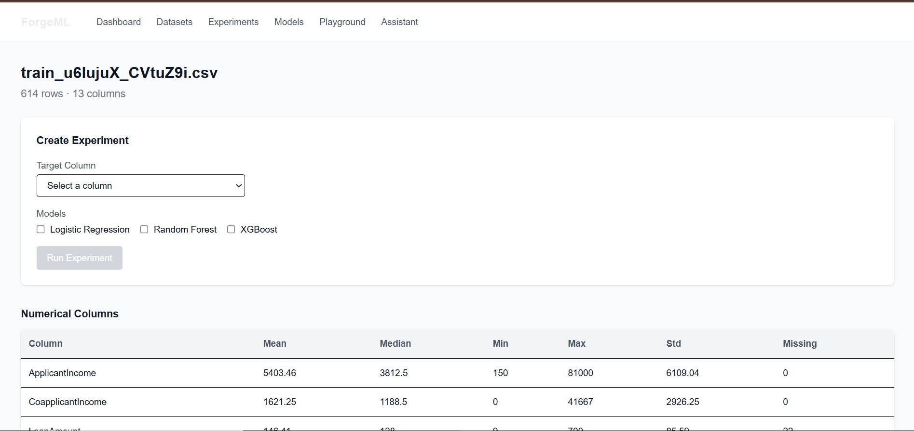
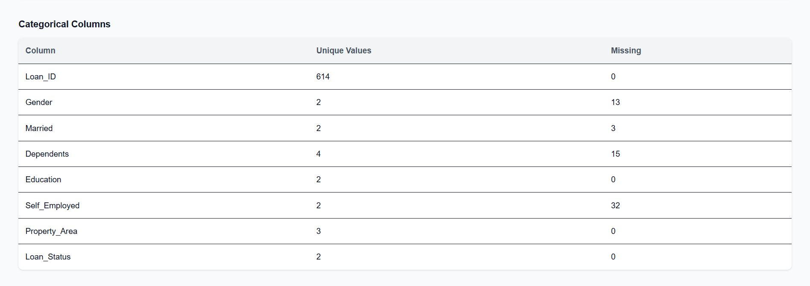

### Creating and comparing experiments
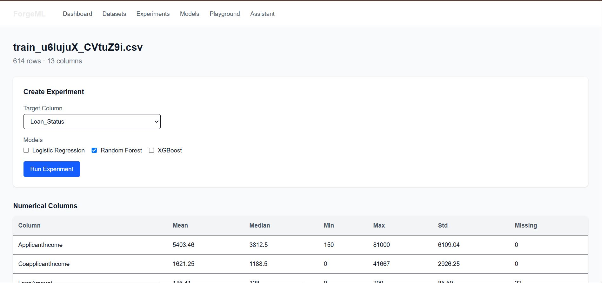
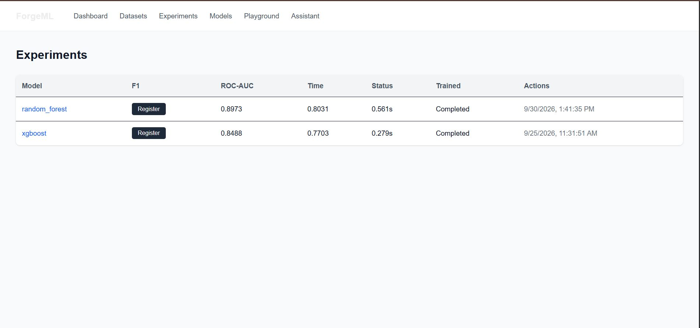
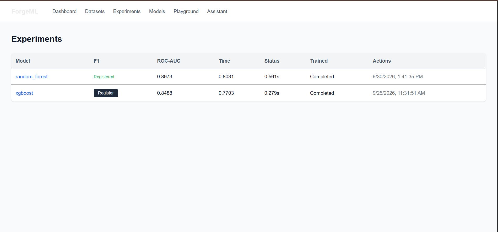

### Model registry
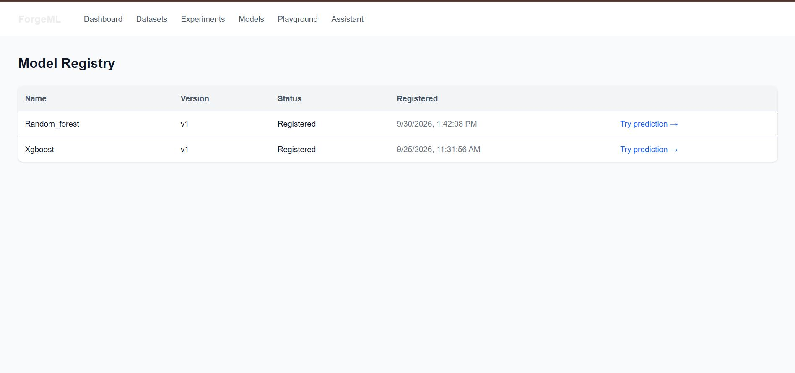

### Prediction playground
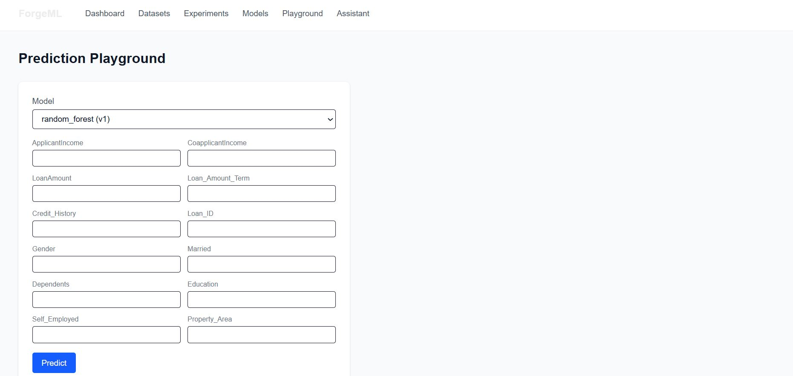
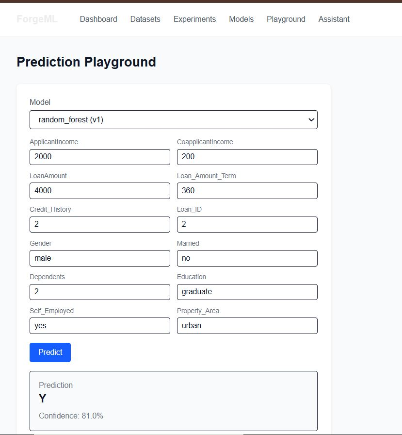

### AI Assistant (LLM-powered)
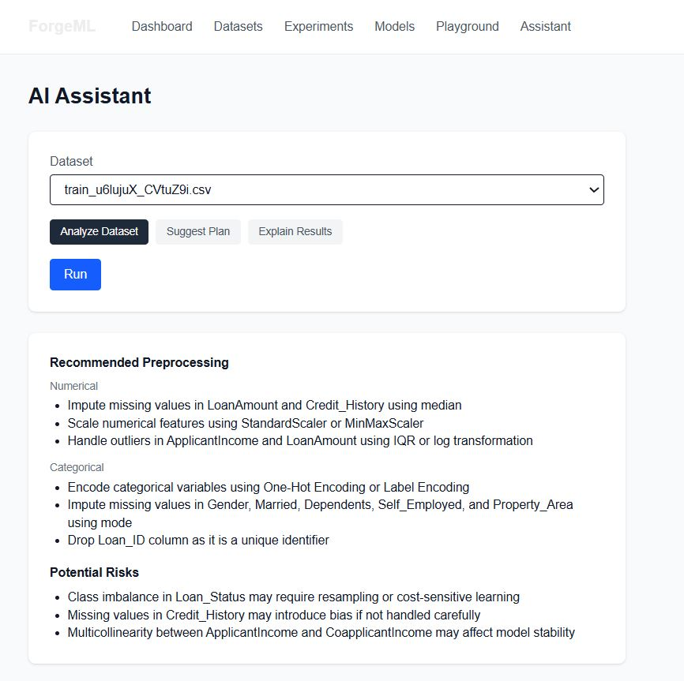
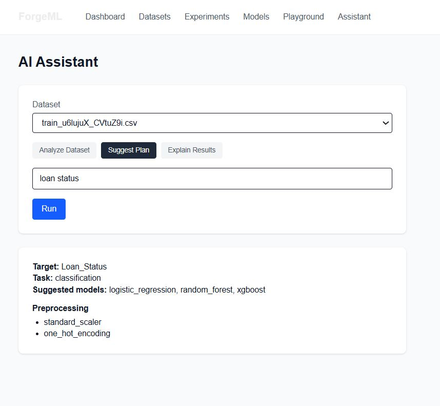
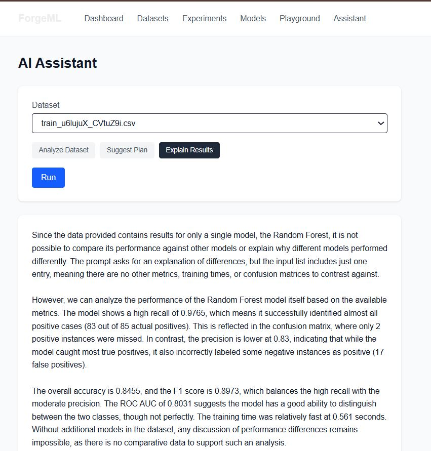

---

## Architecture

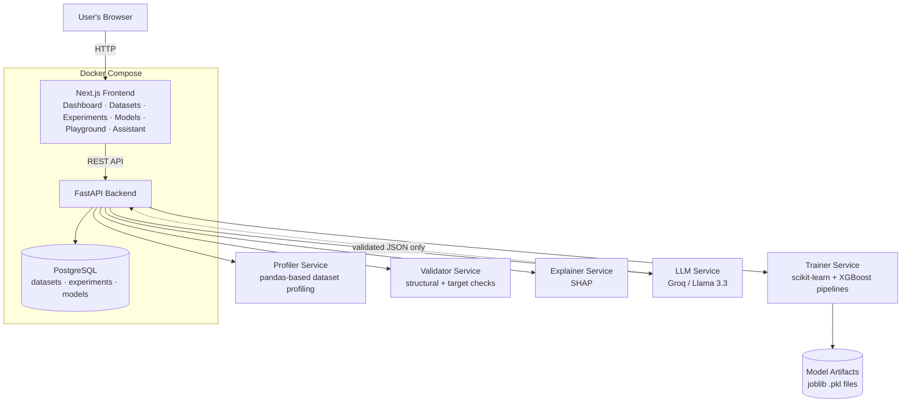

**Request flow for a typical session:**

```text
Upload CSV
   -> Backend profiles + validates it
   -> Saved to disk + Postgres (datasets table)

Pick target column + models, run experiment
   -> Backend preprocesses (impute, scale, one-hot encode)
   -> Trains Logistic Regression / Random Forest / XGBoost
   -> Evaluates (accuracy, precision, recall, F1, ROC-AUC)
   -> Saves trained pipeline to disk, saves results to Postgres

Register a model
   -> Creates a `models` row pointing at the already-saved artifact

Predict / Explain
   -> Loads the saved pipeline
   -> Returns a prediction + probability, or a SHAP-based explanation

AI Assistant
   -> Sends the dataset profile / experiment results to an LLM
   -> Backend validates the LLM's JSON response before trusting it
   -> Returns analysis / a suggested experiment plan / a plain-language explanation
```

---

## Tech Stack

| Layer | Technology |
|---|---|
| Frontend | Next.js 16 (App Router), TypeScript, Tailwind CSS |
| Backend | FastAPI, Python |
| ML | scikit-learn, XGBoost, SHAP |
| Database | PostgreSQL, SQLAlchemy |
| LLM | Groq (Llama 3.3 70B) |
| Testing | pytest, FastAPI TestClient, SQLite (test DB) |
| Infrastructure | Docker, Docker Compose |

---

## Features

- **Dataset upload & profiling** -- row/column counts, missing values,
  duplicates, per-column statistics for numerical and categorical columns
- **Data validation** -- duplicate rows, empty/constant columns,
  high-cardinality ID-like columns, missing target values, class imbalance
- **Model training** -- Logistic Regression, Random Forest, XGBoost, via a
  shared pluggable training interface with a proper preprocessing pipeline
  (median/mode imputation, scaling, one-hot encoding) that avoids data
  leakage (fit on training data only)
- **Experiment tracking** -- every run persisted to PostgreSQL: metrics,
  hyperparameters, training time, timestamp, reproducible via a stored
  random seed
- **Model registry** -- register a trained experiment as a versioned model,
  backed by a saved joblib artifact containing the full
  preprocessing + model pipeline
- **Prediction API** -- raw JSON in, decoded prediction + probability out
- **Explainability (SHAP)** -- global feature importance per model, and
  signed per-feature contributions for a single prediction
- **AI Assistant** -- LLM-backed dataset analysis, experiment planning, and
  results explanation, with structural *and* semantic validation of every
  LLM response before it's trusted (the LLM is an assistant, never the ML
  engine, and never executes arbitrary code)
- **Full test suite** -- 34 tests covering profiling, validation, training
  (including a reproducibility check), and API endpoints (including error
  paths), run against an isolated in-memory test database
- **Fully Dockerized** -- one `docker compose up` brings up Postgres, the
  FastAPI backend, and the Next.js frontend together

---

## Project Structure

```
forgeML/
├── backend/
│   ├── app/
│   │   ├── main.py                  # FastAPI app + all routes
│   │   ├── services/
│   │   │   ├── profiler.py          # dataset profiling
│   │   │   ├── validator.py         # dataset validation
│   │   │   ├── trainer.py           # training orchestration + artifact saving
│   │   │   ├── evaluator.py         # classification metrics
│   │   │   ├── explainer.py         # SHAP explainability
│   │   │   └── llm.py               # Groq LLM calls
│   │   ├── ml/
│   │   │   ├── preprocessing.py     # ColumnTransformer pipeline
│   │   │   └── classification.py    # model registry + train/test split
│   │   ├── models/                  # SQLAlchemy table definitions
│   │   │   ├── dataset.py
│   │   │   ├── experiment.py
│   │   │   └── model_registry.py
│   │   └── core/
│   │       ├── config.py            # environment variables
│   │       ├── database.py          # SQLAlchemy engine/session
│   │       └── schemas.py           # Pydantic request/response schemas
│   ├── tests/                       # pytest suite (34 tests)
│   ├── artifacts/                   # saved model .pkl files
│   ├── storage/datasets/            # saved uploaded CSVs
│   ├── Dockerfile
│   └── requirements.txt
│
├── frontend/
│   ├── src/
│   │   ├── app/                     # Next.js App Router pages
│   │   │   ├── page.tsx             # dashboard
│   │   │   ├── datasets/            # list + detail pages
│   │   │   ├── experiments/         # list page
│   │   │   ├── models/              # registry page
│   │   │   ├── playground/          # prediction UI
│   │   │   └── assistant/           # LLM assistant UI
│   │   ├── components/              # client components (forms, buttons)
│   │   ├── lib/api.ts                # backend API client
│   │   └── types/                   # shared TypeScript types
│   └── Dockerfile
│
├── docker-compose.yml
└── README.md
```

---

## Running the Project

### Option 1 — Docker (recommended)

The whole stack — Postgres, backend, frontend — runs with one command.

1. Copy `backend/.env.example` to `backend/.env` and fill in a `GROQ_API_KEY`
   (free tier available at [console.groq.com](https://console.groq.com)).

2. From the project root:
   ```bash
   docker compose up --build
   ```

3. Open:
   - Frontend: http://localhost:3000
   - Backend API docs: http://localhost:8000/docs

### Option 2 — Running locally without Docker

**Backend:**
```bash
cd backend
python -m venv venv
venv\Scripts\activate        # Windows
source venv/bin/activate     # Mac/Linux

pip install -r requirements.txt

# Start Postgres (if not already running) -- see docker-compose.yml
# for the expected credentials, or run your own local instance.

cp .env.example .env         # fill in DATABASE_URL and GROQ_API_KEY

uvicorn app.main:app --reload
```

**Frontend** (in a separate terminal):
```bash
cd frontend
npm install

# create .env.local:
# NEXT_PUBLIC_API_URL=http://localhost:8000

npm run dev
```

---

## Running the Tests

```bash
cd backend
pytest -v
```

The suite runs against an isolated in-memory SQLite database (see
`tests/conftest.py`) -- it never touches your real Postgres data.

Coverage:
- `test_profiler.py` -- dataset profiling logic (7 tests)
- `test_validator.py` -- structural and target validation (10 tests)
- `test_trainer.py` -- training, including a reproducibility check (6 tests)
- `test_api_datasets.py` -- dataset upload/list/detail endpoints (5 tests)
- `test_api_experiments.py` -- experiment creation, model registration, and
  prediction, including an end-to-end integration test (5 tests)

---

## Example Dataset

This project was built and tested against the
[Loan Prediction Problem Dataset](https://www.kaggle.com/datasets/altruistdelhite04/loan-prediction-problem-dataset)
(614 rows, 13 columns, binary classification target `Loan_Status`) -- but
works with any CSV with a classification target.

---

## Development Roadmap

Built in 8 phases, each committed and tagged separately:

| Phase | What | Status |
|---|---|---|
| 1 | Dataset upload, profiling, structural validation | Done |
| 2 | Preprocessing pipeline, model training, evaluation | Done |
| 3 | PostgreSQL persistence for datasets and experiments | Done |
| 4 | Model registry and prediction API | Done |
| 5 | SHAP-based explainability | Done |
| 6 | Next.js dashboard (all pages) | Done |
| 7 | LLM-assisted analysis, planning, and results explanation | Done |
| 8 | Docker, tests, documentation | Done |

**Not implemented (intentionally out of scope for this version):**
hyperparameter optimization, model drift monitoring, multi-user auth,
cloud deployment, regression tasks (classification only).

---

## License

Built as a personal portfolio/learning project.
