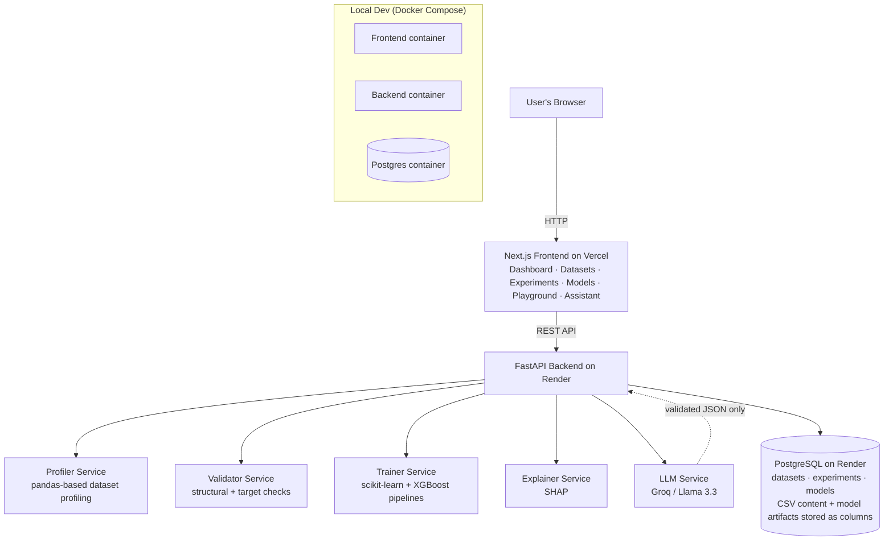

<div align="center">

# 🔨 ForgeML

### Intelligent ML Experimentation & Deployment Platform

Go from a raw CSV to a trained, evaluated, explainable, and deployable ML model — with an LLM-assisted planning and analysis layer on top.

[](https://www.python.org/)
[](https://fastapi.tiangolo.com)
[](https://nextjs.org)
[](https://www.postgresql.org)
[](https://www.docker.com)
[](https://scikit-learn.org)
[](LICENSE)

🔗 **Live App**
👉 [https://forge-ml-gamma.vercel.app](https://forge-ml-gamma.vercel.app)
📡 **API Docs**
👉 [https://forge-ml.onrender.com/docs](https://forge-ml.onrender.com/docs)

[Key Features](#-key-features) •
[Architecture](#%EF%B8%8F-system-architecture) •
[Screenshots](#%EF%B8%8F-screenshots) •
[Getting Started](#-getting-started) •
[API](#-api-endpoints-overview) •
[Roadmap](#%EF%B8%8F-development-roadmap)

</div>

---

## 📖 What is ForgeML?

**ForgeML** is a full-stack, real-world MLOps platform, not just a notebook or a tutorial clone.

It covers the parts of the ML lifecycle that most portfolio projects skip entirely:

- Automated dataset profiling and validation
- A proper preprocessing pipeline (no data leakage)
- Multi-model training and comparison, tracked and persisted
- A model registry with versioning
- A real prediction API
- SHAP-based explainability, global and per-prediction
- An LLM assistant layer — with its output validated, never blindly trusted

Whether you're exploring:

- A **loan approval / credit risk** classifier
- A **churn prediction** model
- Any other **tabular classification** problem

👉 **ForgeML gives you upload-to-prediction, end to end, with nothing hidden in a notebook.**

> **Note on the live demo:** the backend runs on Render's free tier, which
> spins down after 15 minutes of inactivity. The first request after it's
> been idle can take 30–60 seconds to wake up — that's a free-tier
> tradeoff, not a bug.

---

## 🌟 Key Features

| Feature | What It Means for You |
|---|---|
| ⚡ **Full ML Lifecycle** | Upload → profile → validate → train → compare → register → predict → explain, all through real endpoints |
| 🧪 **Multi-Model Training** | Logistic Regression, Random Forest, XGBoost, trained through one shared pluggable interface |
| 🔁 **Reproducible Experiments** | Every run persisted to Postgres with a stored random seed — same inputs, same metrics, every time |
| 📦 **Model Registry** | Register a trained experiment as a versioned model, artifact and all |
| 🔮 **Prediction API** | Raw JSON in, decoded prediction + probability out |
| 🔍 **SHAP Explainability** | Global feature importance, and signed per-feature contributions for a single prediction |
| 🤖 **AI Assistant** | LLM-backed dataset analysis, experiment planning, and results explanation — with every response validated before it's trusted |
| ✅ **34 Passing Tests** | Profiling, validation, training, and API endpoints, including error paths |
| 🐳 **Dockerized** | One `docker compose up` brings up Postgres, backend, and frontend together |
| ☁️ **Actually Deployed** | Live on Render (backend + Postgres) and Vercel (frontend), not just runnable locally |

---

## 🏗️ System Architecture

The system follows a layered architecture — frontend talks only to the API, the API talks to dedicated services for each concern (profiling, validation, training, explaining, LLM calls), and everything persists to one Postgres database.



**Request flow for a typical session:**

```text
Upload CSV
   -> Backend profiles + validates it
   -> CSV content + metadata saved to Postgres (datasets table)

Pick target column + models, run experiment
   -> Backend preprocesses (impute, scale, one-hot encode)
   -> Trains Logistic Regression / Random Forest / XGBoost
   -> Evaluates (accuracy, precision, recall, F1, ROC-AUC)
   -> Serializes the trained pipeline and saves it to Postgres,
      along with the results (experiments table)

Register a model
   -> Creates a `models` row pointing at the already-saved artifact

Predict / Explain
   -> Loads the saved pipeline from Postgres
   -> Returns a prediction + probability, or a SHAP-based explanation

AI Assistant
   -> Sends the dataset profile / experiment results to an LLM
   -> Backend validates the LLM's JSON response before trusting it
   -> Returns analysis / a suggested experiment plan / a plain-language explanation
```

> **Why artifacts live in Postgres, not on disk:** free-tier PaaS hosting
> (this project uses Render) runs the web service on an *ephemeral*
> filesystem — anything written to local disk disappears on every
> restart, redeploy, or free-tier spin-down. Postgres is the only
> genuinely persistent storage available, so both the uploaded CSV
> content and the trained model artifacts are stored directly as database
> columns rather than as files on disk.

---

## 🖼️ Screenshots

### Dashboard


### Dataset upload and profiling


### Creating and comparing experiments


### Model registry


### Prediction playground


### AI Assistant (LLM-powered)


---

## 🧰 Tech Stack

| Layer | Technology |
|---|---|
| Frontend | Next.js 16 (App Router), TypeScript, Tailwind CSS |
| Backend | FastAPI, Python |
| ML | scikit-learn, XGBoost, SHAP |
| Database | PostgreSQL, SQLAlchemy |
| LLM | Groq (Llama 3.3 70B) |
| Testing | pytest, FastAPI TestClient, SQLite (test DB) |
| Infrastructure | Docker, Docker Compose (local dev) · Render (backend + Postgres) · Vercel (frontend) |

---

## 🚀 Getting Started

### Requirements

- Python 3.11+
- Node.js & npm
- Docker Desktop (recommended path)
- A free [Groq API key](https://console.groq.com)

### Option 1 — Docker (recommended)

The whole stack — Postgres, backend, frontend — runs with one command.

```bash
# 1. Copy the env template and fill in GROQ_API_KEY
cp backend/.env.example backend/.env

# 2. From the project root
docker compose up --build
```

Then open:
- Frontend → http://localhost:3000
- Backend API docs → http://localhost:8000/docs

### Option 2 — Run locally without Docker

**Backend:**
```bash
cd backend
python -m venv venv
venv\Scripts\activate        # Windows
source venv/bin/activate     # Mac/Linux

pip install -r requirements.txt

cp .env.example .env         # fill in DATABASE_URL and GROQ_API_KEY
uvicorn app.main:app --reload
```

**Frontend** (separate terminal):
```bash
cd frontend
npm install

# create .env.local:
# NEXT_PUBLIC_API_URL=http://localhost:8000

npm run dev
```

---

## 📡 API Endpoints Overview

Full interactive documentation (Swagger) is available at `/docs` on the
running backend — live at
[forge-ml.onrender.com/docs](https://forge-ml.onrender.com/docs).

### Datasets
- **POST** `/api/datasets/upload` → upload + profile + validate a CSV
- **GET** `/api/datasets` → list all datasets
- **GET** `/api/datasets/{id}` → dataset detail + full profile

### Experiments
- **POST** `/api/experiments` → train one or more models on a dataset
- **GET** `/api/experiments` → list all experiments
- **GET** `/api/experiments/{id}` → single experiment detail

### Models
- **POST** `/api/models/register` → register an experiment as a versioned model
- **GET** `/api/models` → list registered models
- **POST** `/api/models/{id}/predict` → get a prediction + probability
- **GET** `/api/models/{id}/explain` → global SHAP feature importance
- **POST** `/api/models/{id}/explain` → SHAP explanation for one prediction

### AI Assistant
- **POST** `/api/assistant/analyze-dataset` → LLM preprocessing recommendations + risks
- **POST** `/api/assistant/create-plan` → LLM-suggested experiment plan (validated)
- **POST** `/api/assistant/analyze-experiments` → plain-language comparison of real results

---

## 🧪 Running the Tests

```bash
cd backend
pytest -v
```

Runs against an isolated in-memory SQLite database (`tests/conftest.py`) —
never touches real Postgres data.

| Test file | Covers | Count |
|---|---|---|
| `test_profiler.py` | Dataset profiling logic | 7 |
| `test_validator.py` | Structural and target validation | 10 |
| `test_trainer.py` | Training, incl. a reproducibility check | 6 |
| `test_api_datasets.py` | Dataset upload/list/detail endpoints | 5 |
| `test_api_experiments.py` | Experiment, registry, prediction (incl. end-to-end) | 5 |

---

## 📂 Project Structure

```
forgeML/
├── backend/
│   ├── app/
│   │   ├── main.py                  # FastAPI app + all routes
│   │   ├── services/
│   │   │   ├── profiler.py          # dataset profiling
│   │   │   ├── validator.py         # dataset validation
│   │   │   ├── trainer.py           # training orchestration + artifact saving
│   │   │   ├── evaluator.py         # classification metrics
│   │   │   ├── explainer.py         # SHAP explainability
│   │   │   └── llm.py               # Groq LLM calls
│   │   ├── ml/
│   │   │   ├── preprocessing.py     # ColumnTransformer pipeline
│   │   │   └── classification.py    # model registry + train/test split
│   │   ├── models/                  # SQLAlchemy table definitions
│   │   │   ├── dataset.py
│   │   │   ├── experiment.py
│   │   │   └── model_registry.py
│   │   └── core/
│   │       ├── config.py            # environment variables
│   │       ├── database.py          # SQLAlchemy engine/session
│   │       └── schemas.py           # Pydantic request/response schemas
│   ├── tests/                       # pytest suite (34 tests)
│   ├── artifacts/                   # saved model .pkl files
│   ├── storage/datasets/            # saved uploaded CSVs
│   ├── Dockerfile
│   └── requirements.txt
│
├── frontend/
│   ├── src/
│   │   ├── app/                     # Next.js App Router pages
│   │   │   ├── page.tsx             # dashboard
│   │   │   ├── datasets/            # list + detail pages
│   │   │   ├── experiments/         # list page
│   │   │   ├── models/              # registry page
│   │   │   ├── playground/          # prediction UI
│   │   │   └── assistant/           # LLM assistant UI
│   │   ├── components/              # client components (forms, buttons)
│   │   ├── lib/api.ts                # backend API client
│   │   └── types/                   # shared TypeScript types
│   └── Dockerfile
│
├── docker-compose.yml
└── README.md
```

---

## ☁️ Deployment

- **Backend + PostgreSQL:** [Render](https://render.com) — deploys
  directly from `backend/Dockerfile`; `DATABASE_URL` and `GROQ_API_KEY`
  set via Render's dashboard.
- **Frontend:** [Vercel](https://vercel.com) — deploys directly from
  `frontend/`, with `NEXT_PUBLIC_API_URL` pointed at the live backend.
- CORS allows both `localhost:3000` (local dev) and the live Vercel domain.

---

## 📊 Example Dataset

Built and tested against the
[Loan Prediction Problem Dataset](https://www.kaggle.com/datasets/altruistdelhite04/loan-prediction-problem-dataset)
(614 rows, 13 columns, binary target `Loan_Status`) — but works with any
CSV with a classification target.

---

## 🗺️ Development Roadmap

Built in 8 phases, each committed and tagged separately:

| Phase | What | Status |
|---|---|---|
| 1 | Dataset upload, profiling, structural validation | ✅ |
| 2 | Preprocessing pipeline, model training, evaluation | ✅ |
| 3 | PostgreSQL persistence for datasets and experiments | ✅ |
| 4 | Model registry and prediction API | ✅ |
| 5 | SHAP-based explainability | ✅ |
| 6 | Next.js dashboard (all pages) | ✅ |
| 7 | LLM-assisted analysis, planning, results explanation | ✅ |
| 8 | Docker, tests, documentation, live deployment | ✅ |

**Intentionally out of scope:** hyperparameter optimization, model drift
monitoring, multi-user auth, regression tasks (classification only).

---

## 📄 License

MIT — built as a personal portfolio/learning project.

<div align="center">

Built by [Anas](https://github.com/DevAnas19)

</div>